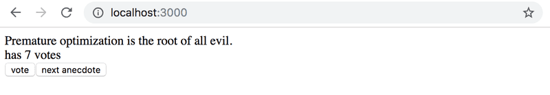

Expand your application so that you can vote for the displayed anecdote.

fullstack content
NB if you decide to store the votes of each anecdote into an array or object in the component's state, you should refer to the material to see the correct way of updating state stored in complex data structures like objects and arrays.

You can create a copy of an object like this:

const points = { 0: 1, 1: 3, 2: 4, 3: 2 }

const copy = { ...points }
// increment the property 2 value by one
copy[2] += 1     
OR a copy of an array like this:

const points = [1, 4, 6, 3]

const copy = [...points]
// increment the value in position 2 by one
copy[2] += 1     
Using an array might be the simpler choice in this case. Googling will provide you with lots of hints on how to create a zero-filled array of a desired length, like this.

