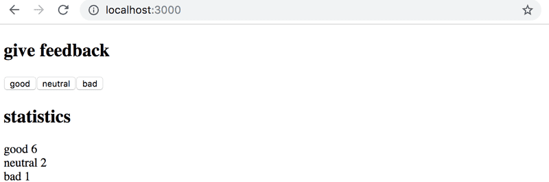

1.6: unicafe step1
Like most companies, Unicafe collects feedback from its customers. Your task is to implement a web application for collecting customer feedback. There are only three options for feedback: good, neutral, and bad.

The application must display the total amount of collected feedback for each category. Your final application could look like this:

fullstack content
Note that your application needs to work only during a single browser session. Once you refresh the page, the collected feedback is allowed to disappear.

You can implement the application in a single index.js file. You can use the code below as a starting point for your application.

import React, { useState } from 'react'
import ReactDOM from 'react-dom'

const App = () => {
  // save clicks of each button to own state
  const [good, setGood] = useState(0)
  const [neutral, setNeutral] = useState(0)
  const [bad, setBad] = useState(0)

  return (
    

      code here
    

  )
}

ReactDOM.render(<App />, 
  document.getElementById('root')
)

